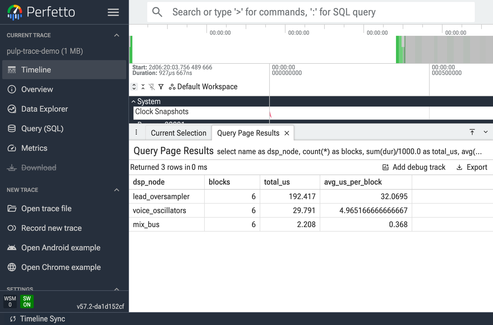
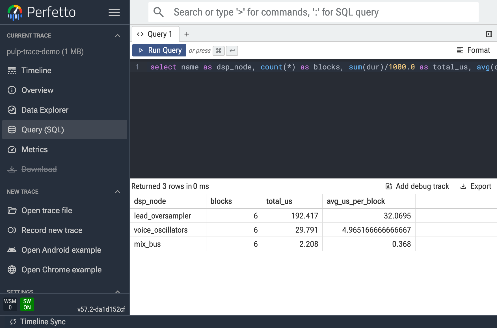
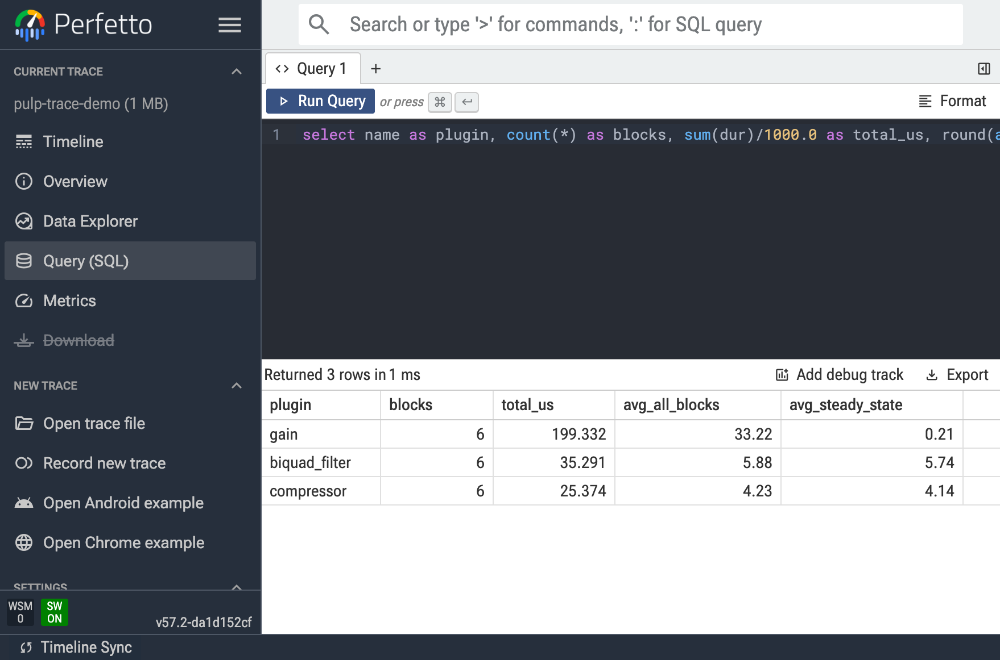

# pulp-perfetto

Perfetto-based DSP tracing for [Pulp](https://github.com/danielraffel/pulp) audio
plugins — see, per audio block, exactly which DSP node ate the time. A scalar CPU
meter tells you *that* you're at 40%; the trace tells you *why*.

**Easy to set up, easy to use.** One command adds the tool
(`pulp tool install trace-processor`) — and you don't need to learn SQL to read a
trace. Just ask in plain English: with the
[Pulp Claude Code plugin](https://github.com/danielraffel/pulp/blob/main/docs/guides/claude-code-plugin.md),
say `/trace "why is my plugin slow to open?"` and the agent captures the trace,
reads it, and answers with a root cause and a fix. (No plugin? The CLI does the
same: `pulp trace explain "..."`.)

## Install

**1. Install [Pulp](https://github.com/danielraffel/pulp)** — most people reading
this already have it.

<details>
<summary>Don't have Pulp yet? Install it (click to expand)</summary>

```bash
# macOS / Linux
curl -fsSL https://www.generouscorp.com/pulp/install.sh | sh
```

```powershell
# Windows (PowerShell)
irm https://www.generouscorp.com/pulp/install.ps1 | iex
```

</details>

**2. Install the trace tool:**

```bash
pulp tool install trace-processor
```

That's the whole setup. This adds Perfetto's `trace_processor` (the query engine),
pinned and verified — nothing to build. You're ready to [use it](#use-it).

> **This repo is a showcase**, not something you clone. The code lives in the Pulp
> SDK; the images below are real trace output.

---

## Use it

**Query / open a trace.** Once Pulp is installed, point `pulp trace` at any
`.pftrace`:

```bash
pulp trace query "<sql>" --trace run.pftrace
pulp trace open run.pftrace            # hand off to ui.perfetto.dev
pulp trace explain "why is my plugin slow?"
```

`pulp trace explain` (and `/trace` in Claude Code) is the plain-English path — no
SQL; it returns a root cause and a fix. Use `query` when you want the raw numbers.

**Capture a trace — a dev-only build option.**
Because tracing instruments *your* DSP, capture is a build flag, never linked into
a shipping plugin. Turn it on for a dev build and annotate the stages you care
about:

```cpp
pulp::runtime::Tracing::start({"dsp", "dsp.node"}, "run.pftrace");
{
    PULP_TRACE_SCOPE_NAMED("dsp.node", "my_stage");   // no-op when PULP_TRACING=OFF
    // ... your DSP ...
}
pulp::runtime::Tracing::stop();
```

```bash
cmake -S . -B build -DCMAKE_BUILD_TYPE=Release -DPULP_TRACING=ON
```

**Static vs dynamic span names.** By default a span's name is **static** —
`PULP_TRACE_SCOPE(category)` uses the enclosing function name and
`PULP_TRACE_SCOPE_NAMED(category, "literal")` a fixed label — which keeps
`GROUP BY name` queries cheap. To make the name carry a **runtime** value (a
parameter name, a graph-node id, a file basename), opt in per call site:

```cpp
PULP_TRACE_SCOPE_DYNAMIC("dsp.node", node.display_name());   // runtime string
```

That's the switch: reach for `_DYNAMIC` only when the runtime value is the thing
you want to query on — it copies the string on every event and raises name
cardinality, so stay static otherwise. All three macros compile to nothing when
`PULP_TRACING` is off, so nothing you add here ships.

Only the **offline** render path is traced. The live `process()` callback is never
instrumented (a `TRACE_EVENT` takes a lock at buffer rollover and is not
real-time-safe); live plugins use a separate fixed-slot telemetry path instead.

Full guide: [`docs/guides/tracing.md`](https://github.com/danielraffel/pulp/blob/main/docs/guides/tracing.md).

---

## Use case 1 — "The load meter said 40%. The trace said *why*."

`examples/trace-demo` renders an offline poly-synth: three cheap sine voices plus
one deliberately expensive 8×-oversampled lead. The average load looks calm, but
the per-block flamegraph shows one node eating every block.

```bash
pulp trace query \
  "select name, count(*) blocks, sum(dur)/1000.0 total_us, round(avg(dur)/1000.0,2) us_per_block \
   from slice where name in ('voice_oscillators','lead_oversampler','mix_bus') \
   group by name order by total_us desc" \
  --trace /tmp/demo.pftrace
```

The `lead_oversampler` node costs **~6× the oscillators and ~87× the mix bus** —
invisible to an average, obvious in the trace.





---

## Use case 2 — "Which plugin in my chain is expensive?" (and why the average lies)

`examples/trace-plugin-chain` profiles a **real** effect chain — `PulpGain` →
`PulpEffect` (a biquad filter) → `PulpCompressor` — driven through each plugin's
actual `process()` code, one `dsp.node` span per plugin per block.

The trace catches a truth a CPU meter inverts:



`gain`'s **average** (33 µs) looks like the worst offender — but nearly all of it
is a one-time cold-start spike on the very first block (the first `process()` call
warms caches and touches fresh pages). Its **steady-state** cost is 0.21 µs. The
real per-block hot node is the biquad filter (5.7 µs), then the compressor
(4.1 µs). The per-block trace separates one-time warmup from the cost that
actually recurs — the whole reason to reach for a trace over an average.

---

## Running these examples from source

The two examples above ship in the Pulp repo and build under the dev-only tracing
option:

```bash
git clone https://github.com/danielraffel/pulp && cd pulp
cmake -S . -B build -DCMAKE_BUILD_TYPE=Release -DPULP_TRACING=ON
cmake --build build --target pulp-trace-demo pulp-trace-plugin-chain \
  -j"$(getconf _NPROCESSORS_ONLN)"
./build/examples/trace-plugin-chain/pulp-trace-plugin-chain 0.06 /tmp/chain.pftrace
```

---

## Credits & licensing

Tracing is a **dev-only, opt-in** subsystem — never linked into a shipping plugin,
never exported by `cmake --install`. Built on:

- [Perfetto](https://github.com/google/perfetto) (Apache-2.0) — the tracing SDK
  (amalgamated `perfetto.cc`/`perfetto.h`) and the `trace_processor` query tool.
- [melatonin_perfetto](https://github.com/sudara/melatonin_perfetto)
  ([MIT](https://github.com/sudara/melatonin_perfetto/blob/main/melatonin_perfetto/melatonin_perfetto.h)) —
  Pulp adapts only its compile-time `PRETTY_FUNCTION` trimmer.

See Pulp's [licensing page](https://www.generouscorp.com/pulp/licensing.html#developer-only-tooling-not-shipped)
and [`NOTICE.md`](https://github.com/danielraffel/pulp/blob/main/NOTICE.md) for full
attribution.

---

*Built with [Pulp](https://github.com/danielraffel/pulp) · traces rendered in
Perfetto v57.2.*
